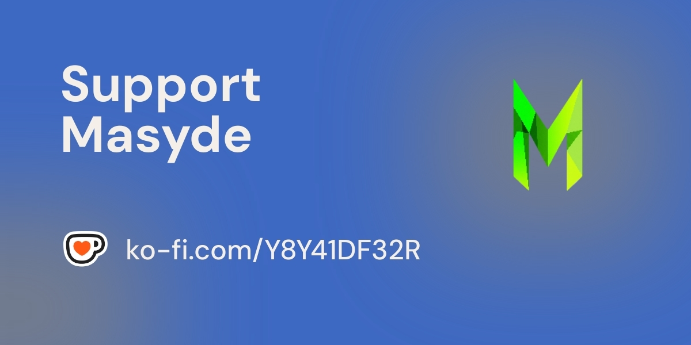

  

<h1 align="center" style="color: #2C2D72; font-size: 32px;">
  Masyde Community
</h1>

  

  
  
    
  

---

<h2 align="center" style="color: #2C2D72;">About Masyde</h2>

  Masyde is an open-source organization committed to developing software projects inspired by community suggestions. We specialize in creating robust tools using <b>Python</b>, <b>C++</b>, and <b>C#</b>, with additional projects in <b>JavaScript</b> for web applications or other languages as required. All projects are hosted on <a href="https://github.com/masyde">github.com/masyde</a> and released under the <b>MIT License</b>.

  We welcome contributions and ideas from developers worldwide. Share your project suggestions on our <a href="https://discord.gg/T2NegRDG3Y">Discord server</a> in the designated channels or contribute directly via GitHub. Community engagement and donations help sustain our efforts to deliver high-quality, accessible software.

---

<h2 align="center" style="color: #2C2D72;">Our Team</h2>

  Masyde is driven by a core team of developers: 
  - <b>stfulua</b> (<a href="discord://-/users/1220840597275934803">Discord ID: 1220840597275934803</a>) 
  - <b>fydedev</b> (<a href="discord://-/users/1235078480270725204">Discord ID: 1235078480270725204</a>)

---

<h2 align="center" style="color: #2C2D72;">Core Technologies</h2>

  
   
  
  
  
  

  Our primary focus is on Python, C++, C#, and JavaScript, but we are flexible and open to adopting other languages and frameworks to meet the needs of our projects.

---

<h2 align="center" style="color: #2C2D72;">Projects & Contributions</h2>

  
  
  

  Explore our repositories on <a href="https://github.com/masyde">GitHub</a> to discover ongoing projects, contribute code, or report issues. Your participation helps shape the future of Masyde’s open-source ecosystem.

---

<h2 align="center" style="color: #2C2D72;">Get Involved</h2>

  📢 <b>Contribute Ideas:</b> Join our <a href="https://discord.gg/T2NegRDG3Y">Discord server</a> to propose projects or collaborate on solutions. 
  📧 <b>Contact Us:</b> Reach out at <a href="mailto:masyde@proton.me">masyde@proton.me</a> for inquiries. 
  

---

  

  <b>Join us in building innovative, open-source software for the community and everyone!</b>

---

  Copyright © 2025 Masyde. All rights reserved.

<!--

**Here are some ideas to get you started:**

🙋‍♀️ A short introduction - what is your organization all about?
🌈 Contribution guidelines - how can the community get involved?
👩‍💻 Useful resources - where can the community find your docs? Is there anything else the community should know?
🍿 Fun facts - what does your team eat for breakfast?
🧙 Remember, you can do mighty things with the power of [Markdown](https://docs.github.com/github/writing-on-github/getting-started-with-writing-and-formatting-on-github/basic-writing-and-formatting-syntax)
-->
